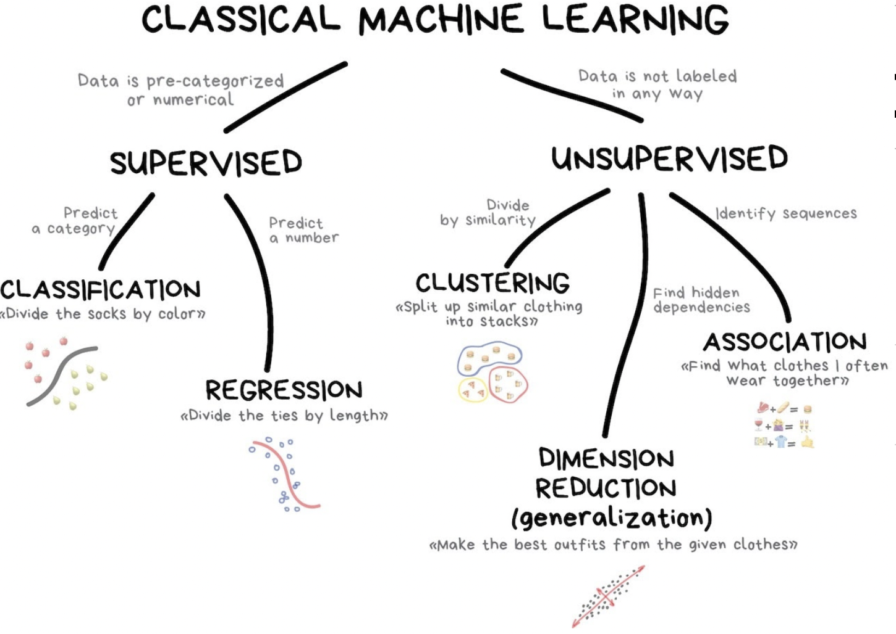
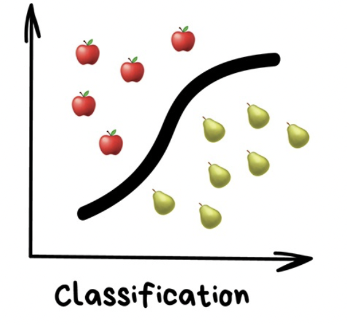
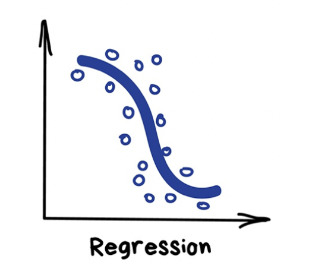
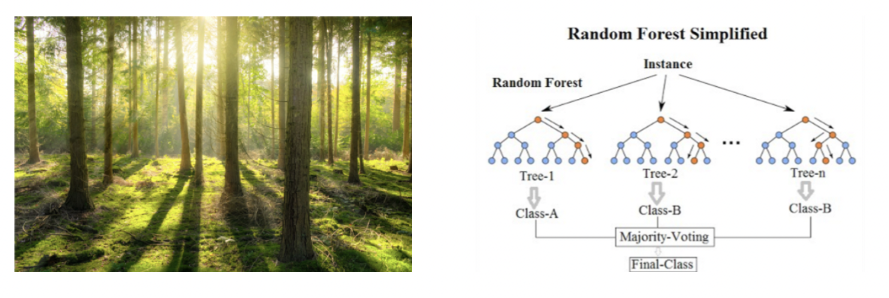

```{r setup, include=FALSE}
knitr::opts_chunk$set(echo = TRUE)
```

# Introucción al aprendizaje automatico

```{r, echo=FALSE, out.width = '100%'}

```

## Aprendizaje supervisado

El objetivo es poder predecir/estimar los valores de una variable $y$ en función de otras variables $x$. 

Podemos pensar el problema de la siguiente manera

$$ y \sim x_1+x_2+...+x_J $$
donde 

* $y$  es la variable de salida/respuesta/dependiente
* $x$ son las variables de entrada/predictoras/independientes/covariables/features

En el aprendizaje supervisado el objetivo es encontrar la mejor función $f$ que prediga los valores de la variable $y$ en función de las variables $x$ basados en los datos.

En otras palabras,  $y=f(x)+e$ en donde $f$ es una función que relaciona las variables de entrada $x$ con la variable de salida $y$. Obviamente, la función $f$ es desconocida y $e$ es el término de error (lo que no puede ser explicado por $f$). La idea, es utilizando los datos poder estimar la función $f$ para poder predecir los datos de la variable de salida, es decir, $\hat y = \hat f (x)$.

Es importante tener en cuenta que vamos a estimar la función $f$ con los datos de entrenamiento y luego vamos a evaluar que tan bueno es nuestro algoritmo evaluando los datos de la $x$ de los datos de test (los que nunca vio) en nuestra función estimada.

Como podemos ver el aprendizaje automático? Como un conjunto de métodos (modelos/algoritmos) para poder estimar $f$ !!


## Clasificación o regresión?

Los problemas de **clasificación** son aquellos en donde la variable de salida $y$  es categórica. Por ejemplo, en el caso binario, el 1 es "tiene/es" y el 0 es "no tiene/no es".  Por lo tanto, en los problemas de clasificación la idea es estimar la probabilidad  de que $y=1$ en función de las variables de entrada $x$, es decir, $P(y=1|x). Obviamente, esto, se puede extender a problemas en donde la variable de salida presenta muchas categorías.

```{r, echo=FALSE, out.width = '100%'}

```

La **regresión** es utilizada cuando la variable de salida $y$ (la que queremos predecir/estimar) es numérica. 


```{r, echo=FALSE, out.width = '100%'}

```

## Dataset de entrenamiento y test

Lo primero que debemos hacer es separar nuestro dataset original en dos, llamados, "dataset de entrenamiento" y "dataset de test". El dataset de entrenamiento (train) consiste generalmente en una proporción grande del dataset original (e.g. 80%). En el dataset de entrenamiento vamos a utilizar a nuestro algoritmo para que pueda aprender de los datos. Finalmente, el dataset de test es utilizado para ver que tan bueno es nuestro algoritmo para predecir datos que nunca ha visto. 

## Perfomance de los algortimos

Para evaluar que tan bueno es  nuestro algoritmo para predecir los valores de la $y$ vamos a utilizar una serie de métricas, las cuales vamos a computarlas tanto para el dataset de entrenamiento como en el dataset de test. 


Un modelo o algoritmo que tiene una perfomance pobre en el dataset de entrenamiento vamos a decir que tiene sub-ajuste (underfitting). Esto implica que el algoritmo no es capaz de generalizar la relación entre la variable de salida $y$ y las variables de entrada $x$

Por otra parte, para un modelo o algoritmo que tenga una buena perfomance en los datos de entrenamiento pero un perfomance pobre en los datos de test, vamos a decir que tiene sobre-ajuste (overfitting). Esto se debe a que el modelo tiene un performance más bajo de lo esperado para datos nuevos (que nunca ha visto). Este problema es de los más comunes debido a que muchos algoritmos son capaces de "memorizar" los datos con los cuales lo estamos entrenando pero pierde la capacidad de generalizar. 


Las métricas que vamos a utilizar van a depender del problema, es decir, si es un problema de clasificación o regresión. Para el caso de los problemas de clasificación vamos a utilizar la `accuracy` (proporción de observaciones que clasifica de forma correcta) y el error cuadrático medio o el $R^2$ para los problemas de regresión.


## Boston Housing

Utilizamos el dataset `BostonHousing`. La descripción de las variable se presenta a continuación:

 * `crim` per capita crime rate by town
 * `zn` proportion of residential land zoned for lots over 25,000 sq. ft
 * `indus` proportion of non-retail business acres per town
 * `chas` Charles River dummy variable (= 1 if tract bounds river; 0  otherwise)
 * `nox` nitric oxide concentration (parts per 10 million)
 * `rm` average number of rooms per dwelling
 * `age` proportion of owner-occupied units built prior to 1940
 * `dis` weighted distances to five Boston employment centers
 * `rad` index of accessibility to radial highways
 * `tax` full-value property tax rate per $10,000
 * `ptratio` pupil-teacher ratio by town
 * `b` proxi for proportion of African American by town
 * `lstat` percentage of lower status of the population
 * `medv` median value of owner-occupied homes in $1000s


El objetivo es predecir el valor de las casas, es decir, la variable de salida $y$ es `medv` y el resto de las variables incluidas en el dataset son las variables de entrada $x$.  

Para la predicción de la variable $y$ vamos a utilizar tres algoritmos:

 * modelos de regresión lineal (`lm`)
 * arboles de regresión (`decision_tree`)
 * bosques aleatorios (`randomforest`)
 

## cargamos paquetes y el dataset

```{r, warning=FALSE, message=FALSE}
library(tidyverse)
library(tidymodels)
library(mlbench)
library(rpart.plot)
library(vip)
data(BostonHousing)
boston =BostonHousing
```

Si bien, los datos previos a realizar los algoritmos deben ser pre-procesados, en un principio, los ponemos "crudos", es decir, "como vienen". Es recomendable siempre hacer lo siguiente:

 * eliminar variables explicativas o de entrada que se encuentren correlacionadas
 * eliminar o imputar datos faltantes
 * normalizar los datos

## Separación o split del dataset

Separamos el dataset original de forma aleatoria en dos: uno de entrenamiento y otro de test.  El dataset de entrenamiento es donde vamos a entrenar o estimar el algoritmo. Una vez realizado lo anterior, el perfomance del algoritmo, es decir, que tan bien predice para datos que NUNCA vio, lo vamos a hacer en los datos de test.

Definimos el dataset de test como un 20% de los datos originales

```{r}
set.seed(1234)
boston_split = initial_split(boston,prop=0.80)
boston_split
```
Guardamos los dataset con nombres

```{r}
# datos de entrenamiento
boston_train = training(boston_split)
# datos de test
boston_test = testing(boston_split)
```

## Regresión lineal

Como primer paso hacemos la regresión lineal

```{r}
boston_lm =linear_reg() %>% 
          set_engine('lm') %>% 
          fit(medv~., data=boston_train)
boston_lm %>% tidy()
```


```{r}
resultados_lm_train = boston_train %>% select(medv) %>%  
  bind_cols(predict(boston_lm, boston_train)) %>% 
  rename(.pred_lm=.pred)
resultados_lm_train  %>% head()
```

```{r}
resultados_lm_train %>% ggplot(aes(x=medv,y=.pred_lm))+geom_point()+theme_bw()
```

**Computamos algunas métricas** para evaluar que tan bueno es nuestro modelo

```{r}
metrics(resultados_lm_train, truth = medv, estimate = .pred_lm)
```

Por defecto devuelve tres 

$$\text{rmse}= \sqrt{\frac{1}{n}\times \sum (y_i -\hat y_i)^2}$$

$$\text{rsq}=1- \frac{\sum (y_i-\hat y_i)^2}{\sum (y_i-\bar y )^2}$$

$$\text{mae}= \frac{1}{n}\times \sum |y_i-\hat y_i|$$


Evaluamos que tan bueno es nuestro modelo con datos que no utilizo para aprender o entrenar

```{r}
resultados_lm_test= boston_test %>% select(medv) %>%  
  bind_cols(predict(boston_lm, boston_test)) %>% 
  rename(.pred_lm=.pred)
resultados_lm_test %>% head()
```


```{r}
resultados_lm_test %>% ggplot(aes(x=medv,y=.pred_lm))+geom_point()+theme_bw()

```


```{r}
metrics(resultados_lm_test, truth = medv, estimate = .pred_lm)
```


## Arboles de regresión


```{r}
boston_tree = decision_tree() %>% 
              set_engine('rpart') %>% 
              set_mode('regression') %>% 
              fit(medv~.,  data= boston_train)
```


Visualizamos el árbol que entrenamos

```{r}
rpart.plot(boston_tree$fit, roundint = FALSE)
```

En este caso, la predicción $\hat y_i$ es el promedio de la variable $y$ del nodo. 
```{r}
resultados_tree_train= boston_train %>% select(medv) %>%  
  bind_cols(predict(boston_tree, boston_train)) %>% 
  rename(.pred_tree=.pred)
resultados_tree_train %>% head()
```


```{r}
resultados_tree_train %>% ggplot(aes(x=medv,y=.pred_tree))+geom_point()+ theme_bw()
```

Evaluamos la performance del algoritmo en los datos de entrenamiento

```{r}
metrics(resultados_tree_train, truth = medv, estimate = .pred_tree)
```

Evaluamos el algoritmo en los datos de test

```{r}
resultados_tree_test= boston_test %>% select(medv) %>%  
  bind_cols(predict(boston_tree, boston_test)) %>% 
  rename(.pred_tree=.pred)
resultados_tree_test %>% head()
```
```{r}
metrics(resultados_tree_test, truth = medv, estimate = .pred_tree)
```


## Random Forest

Random Forest o bosques aleatorios es un algoritmo que busca mejorar la perfomance en comparación a un único árbol. La idea? crear un bosque (muchos arboles) y luego predecir promediando los resultados de todos los arboles.

```{r, echo=FALSE, out.width = '100%'}

```


Por ultimo, aplicamos el algoritmo random forest. Hacemos un bosque con 1000 arboles o estimadores. 

```{r}
set.seed(1234)

boston_rf = rand_forest(trees = 1000) %>%
  set_engine('ranger',importance='impurity') %>%
  set_mode('regression') %>% 
  fit(medv~., data=boston_train)
boston_rf
```


```{r}
resultados_rf_train= boston_train %>% select(medv) %>%  
  bind_cols(predict(boston_rf, boston_train)) %>% 
  rename(.pred_rf=.pred)
resultados_rf_train %>% head()
```


```{r}
resultados_rf_train %>% ggplot(aes(x=medv,y=.pred_rf))+geom_point()+ theme_bw()
```

```{r}
metrics(resultados_rf_train, truth = medv, estimate = .pred_rf)
```

Evaluamos el algoritmo en los datos de test


```{r}
resultados_rf_test= boston_test %>% select(medv) %>%  
  bind_cols(predict(boston_rf, boston_test)) %>% 
  rename(.pred_rf=.pred)
resultados_rf_test %>% head()
```


```{r}
resultados_rf_test %>% ggplot(aes(x=medv,y=.pred_rf))+geom_point()+ theme_bw()
```

```{r}
metrics(resultados_rf_test, truth = medv, estimate = .pred_rf)
```


```{r}
boston_rf %>% vip()
```


## Iris 

La idea es poder **clasificar** la especie en base a algunas características de las flores  
```{r}
iris %>% head()
```

 * `sepal` length in cm 
 * `sepal` width in cm 
 * `petal` length in cm 
 * `petal` width in cm 
 * `Species` Setosa,versicolor, virginica

En este caso, la variable de salida $y$ es la especie (`Species`) y el resto de las variables del dataset son las de entrada/explicativas $x$

Como paso previo, hacemos algunas visualizaciones para explorar un poco los datos

```{r}
iris %>% ggplot(aes(x=Sepal.Length,
                    y=Sepal.Width,
                    color=Species))+geom_point() + theme_light()
```


```{r}
iris %>% ggplot(aes(x=Petal.Length,
                    y=Petal.Width,
                    color=Species))+geom_point() + theme_light()
```


## Separación o split del dataset

```{r}
set.seed(12345)
iris_split = initial_split(data= iris, prop=0.8)
iris_split
```


```{r}
# datos de entrenamiento
iris_train = training(iris_split)
# datos de test
iris_test = testing(iris_split)
```

## Arboles de clasificación.

En este caso, la predicción de la clase o categoría cuando utilizamos arboles es la moda (la clase con mayor frecuencia) dentro del nodo. 


```{r}
iris_tree = decision_tree() %>% 
              set_engine('rpart') %>% 
              set_mode('classification') %>% 
              fit(Species~.,  data= iris_train)
```


Visualizamos el árbol que entrenamos

```{r}
rpart.plot(iris_tree$fit, roundint = FALSE)
```


```{r}
resultados_tree_train= iris_train %>% select(Species) %>%  
  bind_cols(predict(iris_tree, iris_train)) %>% 
  rename(.pred_tree=.pred_class)
resultados_tree_train %>% head()
```

Calculamos las métricas para los datos de entrenamiento

```{r}
metrics(resultados_tree_train, truth = Species, estimate = .pred_tree)
```

La métrica `accuracy` nos dice el porcentaje de observaciones que fueron clasificadas de forma correcta.

Hacemos la **matriz de confusión**

```{r}
cm = conf_mat(resultados_tree_train, truth = Species, estimate = .pred_tree)
cm
```

Visualizamos la matriz de confusión

```{r}
autoplot(cm, type = "heatmap")
```

Evaluamos el algoritmo en los datos de test


```{r}
resultados_tree_test = iris_test %>% select(Species) %>%  
  bind_cols(predict(iris_tree, iris_test)) %>% 
  rename(.pred_tree=.pred_class)
resultados_tree_test%>% head()
```


Calculamos las métricas para los datos de test

```{r}
metrics(resultados_tree_test, truth = Species, estimate = .pred_tree)
```


```{r}
cm_test = conf_mat(resultados_tree_test, truth = Species, estimate = .pred_tree)
cm_test
```

Visualizamos la matriz de confusión

```{r}
autoplot(cm_test, type = "heatmap")
```

## Random Forest

En este caso, la predicción de la clase se realiza por el voto mayoritario.


```{r}
set.seed(1234)
iris_rf = rand_forest(trees = 1000) %>%
  set_engine('ranger') %>%
  set_mode('classification') %>% 
  fit(Species~., data=iris_train)
iris_rf
```


```{r}
resultados_rf_train = iris_train %>% select(Species) %>%  
  bind_cols(predict(iris_rf, iris_train)) %>% 
  rename(.pred_tree=.pred_class)
resultados_rf_train%>% head()
```


Calculamos las métricas para los datos de entrenamiento

```{r}
metrics(resultados_rf_train, truth = Species, estimate = .pred_tree)
```


```{r}
cm_train = conf_mat(resultados_rf_train, truth = Species, estimate = .pred_tree)
cm_train
```

Visualizamos la matriz de confusión

```{r}
autoplot(cm_train, type = "heatmap")
```

Ídem, pero para los datos del test


```{r}
resultados_rf_test = iris_test %>% select(Species) %>%  
  bind_cols(predict(iris_rf, iris_test)) %>% 
  rename(.pred_tree=.pred_class)
resultados_rf_test %>% head()
```


Calculamos las métricas para los datos de entrenamiento

```{r}
metrics(resultados_rf_test, truth = Species, estimate = .pred_tree)
```


```{r}
cm_test = conf_mat(resultados_rf_test, truth = Species, estimate = .pred_tree)
cm_test
```

Visualizamos la matriz de confusión

```{r}
autoplot(cm_train, type = "heatmap")
```

```{r}

```


## Haciendo recetas.

Antes de realizar cualquier algoritmo, es necesario hacer un pre-procesamiento a los datos. La versión corta es:

 * definir la variable de salida $y$ y las variables predictoras $x$
 * remover o imputar datos faltantes (si es que los hay!)
 * escalar los datos (si es necesario!)
 * convertir las variables de tipo factor en indicadoras (si es que hay y si es que es necesario)


